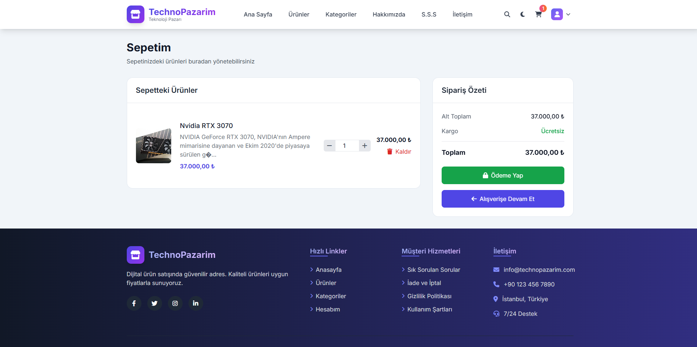
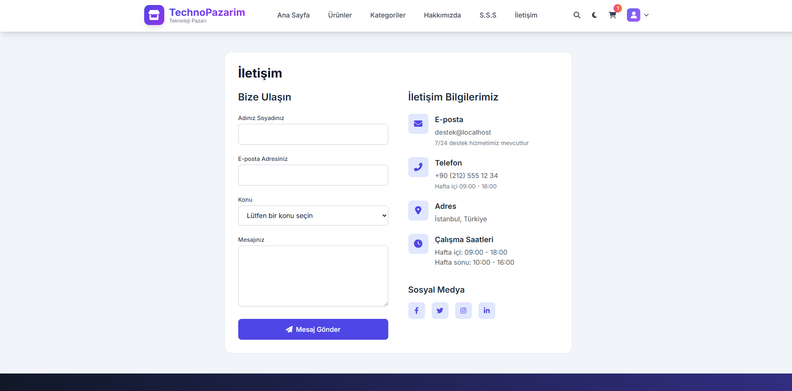
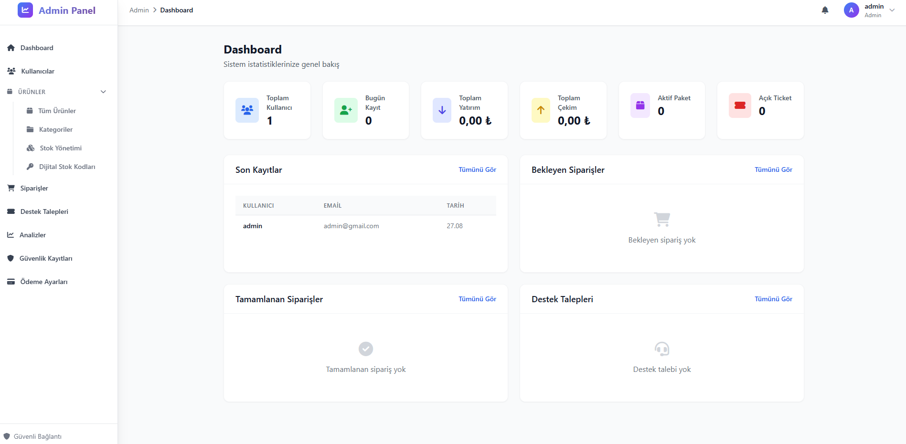
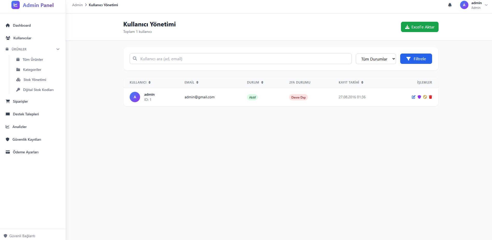

# TechnoPazarim - Dijital Ürün Satış Platformu

TechnoPazarim, dijital ürünlerin satılmasını sağlayan modern bir e-ticaret platformudur. Oyunlar, yazılımlar ve diğer dijital içerikler için kapsamlı bir çözüm sunar.










## Özellikler

### Müşteri Tarafı
- **Modern ve Duyarlı Tasarım**: Tüm cihazlarda sorunsuz çalışan, mobil uyumlu arayüz
- **Ürün Yönetimi**: Kategorilere ayrılmış ürün listeleme, arama ve filtreleme
- **Ürün Detay Sayfaları**: Görsel galeri, incelemeler ve detaylı açıklama
- **Alışveriş Sepeti**: Ürün ekleme, çıkarma ve miktar güncelleme
- **Güvenli Ödeme**: Shopier entegrasyonu ile güvenli ödeme işlemleri
- **İki Faktörlü Kimlik Doğrulama (2FA)**: Hesap güvenliği için Google Authenticator desteği
- **Müşteri Paneli**: Sipariş geçmişi, indirme merkezi ve destek sistemi
- **Açık/Koyu Mod**: Kullanıcı tercihine göre tema değiştirme

### Yönetici Tarafı
- **Ürün Yönetimi**: Dijital ürünlerin eklenmesi, düzenlenmesi ve silinmesi
- **Dijital Stok Takibi**: Lisans anahtarları ve dosya tabanlı ürünler için stok yönetimi
- **Sipariş ve Ödeme Yönetimi**: Sipariş durumları, ödeme takibi ve raporlama
- **Destek Talebi Sistemi**: Müşteri destek taleplerinin yönetimi
- **Analiz ve İstatistikler**: Satış raporları, ziyaretçi analizi ve performans metrikleri
- **Kullanıcı Yönetimi**: Kullanıcı hesapları, roller ve yetkiler
- **Güvenlik Kayıtları**: Giriş denemeleri ve güvenlik olaylarının izlenmesi
- **Açık/Koyu Mod**: Yönetici paneli için tema desteği

## Teknik Özellikler

### Teknolojiler
- **Backend**: PHP (PDO ile MySQL)
- **Frontend**: HTML5, CSS3, JavaScript, Bootstrap 5
- **Veritabanı**: MySQL
- **Ödeme**: Shopier API entegrasyonu
- **Güvenlik**: İki Faktörlü Kimlik Doğrulama (2FA), Prepared Statements

### Güvenlik Özellikleri
- İki Faktörlü Kimlik Doğrulama (2FA)
- Güvenli ödeme işlemleri
- XSS ve SQL Injection korumaları
- Oturum yönetimi
- Güvenlik olaylarının kaydedilmesi

### Duyarlı Tasarım
- Mobil cihazlar için optimize edilmiş arayüz
- Tablet ve masaüstü bilgisayarlar için uyumlu tasarım
- Esnek grid sistemi ile tüm ekran boyutlarında düzgün görüntüleme

### Tema Desteği
- Açık ve koyu tema seçenekleri
- Sistem tercihlerine göre otomatik tema seçimi
- Kullanıcı tercihlerinin localStorage'da saklanması

## Kurulum

1. Dosyaları web sunucunuza yükleyin
2. `db.sql` dosyasını veritabanınıza içe aktarın
3. `config.php` dosyasında veritabanı ayarlarını yapılandırın
4. Shopier API anahtarlarınızı `config.php` dosyasında tanımlayın

## Kullanım

### Yönetici Paneli
- Giriş: `/admin`
- Varsayılan yönetici hesabı:
  - E-posta: admin@gmail.com
  - Kullanıcı adı: admin
  - Şifre: admin

### Müşteri Hesabı
- Yeni kullanıcı kaydı: `/index.php?page=kayit`
- Giriş: `/index.php?page=login`

## Dosya Yapısı

```
technopazarim/
├── admin/                 # Yönetici paneli
│   ├── assets/            # CSS ve JavaScript dosyaları
│   ├── pages/             # Yönetici sayfaları
│   └── index.php          # Yönetici paneli giriş noktası
├── ajax/                  # AJAX işlemleri
├── assets/                # Genel CSS ve JavaScript dosyaları
├── includes/              # Ortak bileşenler
├── pages/                 # Müşteri sayfaları
├── pay/                   # Ödeme ile ilgili dosyalar
│   └── shopier/           # Shopier entegrasyon dosyaları
├── config.php             # Yapılandırma dosyası
├── db.sql                 # Veritabanı şeması
├── index.php              # Ana giriş noktası
└── README.md              # Bu dosya
```

## Geliştirme

### Gereksinimler
- PHP 7.0 veya üzeri
- MySQL 5.6 veya üzeri
- Web sunucu (Apache/Nginx)

### Katkıda Bulunma
TechnoPazarim'i geliştirmemizde bize yardımcı olmaktan çekinmeyin! İşte nasıl yardımcı olabileceğiniz:

1. Depoyu fork'layın
2. Yeni bir dal oluşturun (`git checkout -b feature/yeniozelli̇k`)
3. Değişikliklerinizi yapın
4. Değişikliklerinizi commit'leyin (`git commit -am 'Yeni özellik ekle'`)
5. Dalınızı push'layın (`git push origin feature/yeniozelli̇k`)
6. Yeni bir Pull Request oluşturun

Bu projeyi faydalı bulursanız:
- ⭐ Yıldız verin!
- 📢 Başkalarıyla paylaşın
- 🐛 Hataları bildirin
- 💡 Yeni özellikler önerin
- 💻 Kod katkısında bulunun

### Ticari Kullanım İçin Önemli Bildirim
Bu projeyi ticari faaliyetler için kullanmadan önce izin almak için lütfen **bootkitt@protonmail.com** adresine e-posta gönderin.

## Lisans

Bu proje MIT Lisansı ile lisanslanmıştır. Detaylar için [LICENSE](LICENSE) dosyasına bakın.

## İletişim

Proje ile ilgili sorularınız için lütfen issue oluşturun veya e-posta gönderin.