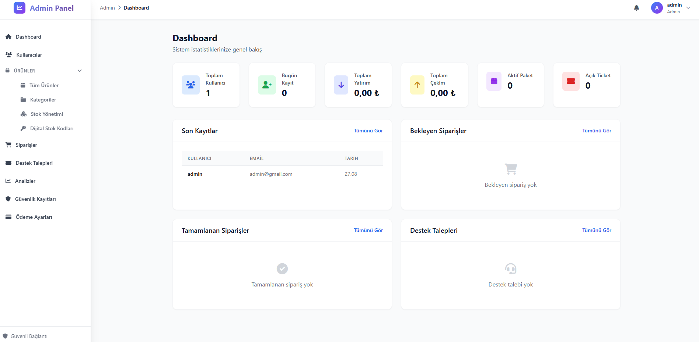
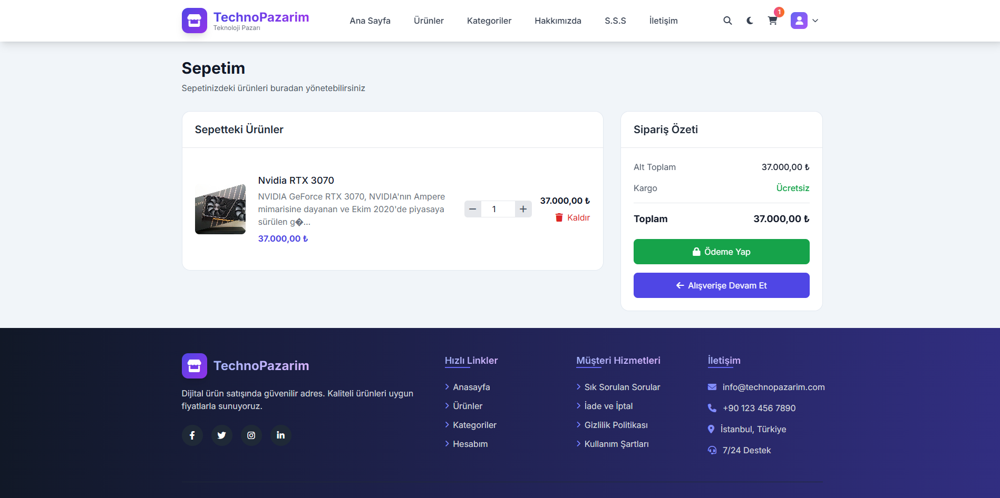

# TechnoPazarim - Digital Product Sales Platform

TechnoPazarim is a modern e-commerce platform for selling digital products. It provides a comprehensive solution for games, software, and other digital content.






## Features

### Customer Side
- **Modern and Responsive Design**: Smooth interface that works on all devices, mobile compatible
- **Product Management**: Categorized product listing, search and filtering
- **Product Detail Pages**: Image gallery, reviews and detailed description
- **Shopping Cart**: Add, remove products and update quantities
- **Secure Payment**: Secure payment processing with Shopier integration
- **Two-Factor Authentication (2FA)**: Account security with Google Authenticator support
- **Customer Panel**: Order history, download center and support system
- **Light/Dark Mode**: Theme switching based on user preference

### Admin Side
- **Product Management**: Adding, editing and deleting digital products
- **Digital Stock Tracking**: Inventory management for license keys and file-based products
- **Order and Payment Management**: Order statuses, payment tracking and reporting
- **Support Ticket System**: Management of customer support requests
- **Analytics and Statistics**: Sales reports, visitor analytics and performance metrics
- **User Management**: User accounts, roles and permissions
- **Security Logs**: Tracking login attempts and security events
- **Light/Dark Mode**: Theme support for admin panel

## Technical Features

### Technologies
- **Backend**: PHP (PDO with MySQL)
- **Frontend**: HTML5, CSS3, JavaScript, Bootstrap 5
- **Database**: MySQL
- **Payment**: Shopier API integration
- **Security**: Two-Factor Authentication (2FA), Prepared Statements

### Security Features
- Two-Factor Authentication (2FA)
- Secure payment transactions
- XSS and SQL Injection protections
- Session management
- Recording of security events

### Responsive Design
- Interface optimized for mobile devices
- Compatible design for tablets and desktop computers
- Flexible grid system for proper display on all screen sizes

### Theme Support
- Light and dark theme options
- Automatic theme selection based on system preferences
- Storage of user preferences in localStorage

## Installation

1. Upload files to your web server
2. Import the `db.sql` file into your database
3. Configure database settings in `config.php`
4. Define your Shopier API keys in `config.php`

## Usage

### Admin Panel
- Login: `/admin`
- Default admin account:
  - Email: admin@gmail.com
  - Username: admin
  - Password: admin

### Customer Account
- New user registration: `/index.php?page=kayit`
- Login: `/index.php?page=login`

## File Structure

```
technopazarim/
├── admin/                 # Admin panel
│   ├── assets/            # CSS and JavaScript files
│   ├── pages/             # Admin pages
│   └── index.php          # Admin panel entry point
├── ajax/                  # AJAX operations
├── assets/                # General CSS and JavaScript files
├── includes/              # Common components
├── pages/                 # Customer pages
├── pay/                   # Payment related files
│   └── shopier/           # Shopier integration files
├── config.php             # Configuration file
├── db.sql                 # Database schema
├── index.php              # Main entry point
└── README.md              # This file
```

## Development

### Requirements
- PHP 7.0 or higher
- MySQL 5.6 or higher
- Web server (Apache/Nginx)

### Contributing
We welcome contributions to improve TechnoPazarim! Here's how you can help:

1. Fork the repository
2. Create a new branch (`git checkout -b feature/newfeature`)
3. Make your changes
4. Commit your changes (`git commit -am 'Add new feature'`)
5. Push to the branch (`git push origin feature/newfeature`)
6. Create a new Pull Request

If you find this project useful:
- ⭐ Give it a star!
- 📢 Share it with others
- 🐛 Report bugs
- 💡 Suggest new features
- 💻 Contribute code

### Important Notice for Commercial Use
Before using this project for commercial activities, please contact **bootkitt@protonmail.com** for permission.

## License

This project is licensed under the MIT License. See the [LICENSE](LICENSE) file for details.

## Contact

For questions about the project, please create an issue or send an email.

---

# TechnoPazarim - Dijital Ürün Satış Platformu

TechnoPazarim, dijital ürünlerin satılmasını sağlayan modern bir e-ticaret platformudur. Oyunlar, yazılımlar ve diğer dijital içerikler için kapsamlı bir çözüm sunar.


## Özellikler

### Müşteri Tarafı
- **Modern ve Duyarlı Tasarım**: Tüm cihazlarda sorunsuz çalışan, mobil uyumlu arayüz
- **Ürün Yönetimi**: Kategorilere ayrılmış ürün listeleme, arama ve filtreleme
- **Ürün Detay Sayfaları**: Görsel galeri, incelemeler ve detaylı açıklama
- **Alışveriş Sepeti**: Ürün ekleme, çıkarma ve miktar güncelleme
- **Güvenli Ödeme**: Shopier entegrasyonu ile güvenli ödeme işlemleri
- **İki Faktörlü Kimlik Doğrulama (2FA)**: Hesap güvenliği için Google Authenticator desteği
- **Müşteri Paneli**: Sipariş geçmişi, indirme merkezi ve destek sistemi
- **Açık/Koyu Mod**: Kullanıcı tercihine göre tema değiştirme

### Yönetici Tarafı
- **Ürün Yönetimi**: Dijital ürünlerin eklenmesi, düzenlenmesi ve silinmesi
- **Dijital Stok Takibi**: Lisans anahtarları ve dosya tabanlı ürünler için stok yönetimi
- **Sipariş ve Ödeme Yönetimi**: Sipariş durumları, ödeme takibi ve raporlama
- **Destek Talebi Sistemi**: Müşteri destek taleplerinin yönetimi
- **Analiz ve İstatistikler**: Satış raporları, ziyaretçi analizi ve performans metrikleri
- **Kullanıcı Yönetimi**: Kullanıcı hesapları, roller ve yetkiler
- **Güvenlik Kayıtları**: Giriş denemeleri ve güvenlik olaylarının izlenmesi
- **Açık/Koyu Mod**: Yönetici paneli için tema desteği

## Teknik Özellikler

### Teknolojiler
- **Backend**: PHP (PDO ile MySQL)
- **Frontend**: HTML5, CSS3, JavaScript, Bootstrap 5
- **Veritabanı**: MySQL
- **Ödeme**: Shopier API entegrasyonu
- **Güvenlik**: İki Faktörlü Kimlik Doğrulama (2FA), Prepared Statements

### Güvenlik Özellikleri
- İki Faktörlü Kimlik Doğrulama (2FA)
- Güvenli ödeme işlemleri
- XSS ve SQL Injection korumaları
- Oturum yönetimi
- Güvenlik olaylarının kaydedilmesi

### Duyarlı Tasarım
- Mobil cihazlar için optimize edilmiş arayüz
- Tablet ve masaüstü bilgisayarlar için uyumlu tasarım
- Esnek grid sistemi ile tüm ekran boyutlarında düzgün görüntüleme

### Tema Desteği
- Açık ve koyu tema seçenekleri
- Sistem tercihlerine göre otomatik tema seçimi
- Kullanıcı tercihlerinin localStorage'da saklanması

## Kurulum

1. Dosyaları web sunucunuza yükleyin
2. `db.sql` dosyasını veritabanınıza içe aktarın
3. `config.php` dosyasında veritabanı ayarlarını yapılandırın
4. Shopier API anahtarlarınızı `config.php` dosyasında tanımlayın

## Kullanım

### Yönetici Paneli
- Giriş: `/admin`
- Varsayılan yönetici hesabı:
  - E-posta: admin@gmail.com
  - Kullanıcı adı: admin
  - Şifre: admin

### Müşteri Hesabı
- Yeni kullanıcı kaydı: `/index.php?page=kayit`
- Giriş: `/index.php?page=login`

## Dosya Yapısı

```
technopazarim/
├── admin/                 # Yönetici paneli
│   ├── assets/            # CSS ve JavaScript dosyaları
│   ├── pages/             # Yönetici sayfaları
│   └── index.php          # Yönetici paneli giriş noktası
├── ajax/                  # AJAX işlemleri
├── assets/                # Genel CSS ve JavaScript dosyaları
├── includes/              # Ortak bileşenler
├── pages/                 # Müşteri sayfaları
├── pay/                   # Ödeme ile ilgili dosyalar
│   └── shopier/           # Shopier entegrasyon dosyaları
├── config.php             # Yapılandırma dosyası
├── db.sql                 # Veritabanı şeması
├── index.php              # Ana giriş noktası
└── README.md              # Bu dosya
```

## Geliştirme

### Gereksinimler
- PHP 7.0 veya üzeri
- MySQL 5.6 veya üzeri
- Web sunucu (Apache/Nginx)

### Katkıda Bulunma
TechnoPazarim'i geliştirmemizde bize yardımcı olmaktan çekinmeyin! İşte nasıl yardımcı olabileceğiniz:

1. Depoyu fork'layın
2. Yeni bir dal oluşturun (`git checkout -b feature/yeniozelli̇k`)
3. Değişikliklerinizi yapın
4. Değişikliklerinizi commit'leyin (`git commit -am 'Yeni özellik ekle'`)
5. Dalınızı push'layın (`git push origin feature/yeniozelli̇k`)
6. Yeni bir Pull Request oluşturun

Bu projeyi faydalı bulursanız:
- ⭐ Yıldız verin!
- 📢 Başkalarıyla paylaşın
- 🐛 Hataları bildirin
- 💡 Yeni özellikler önerin
- 💻 Kod katkısında bulunun

### Ticari Kullanım İçin Önemli Bildirim
Bu projeyi ticari faaliyetler için kullanmadan önce izin almak için lütfen **bootkitt@protonmail.com** adresine e-posta gönderin.

## Lisans

Bu proje MIT Lisansı ile lisanslanmıştır. Detaylar için [LICENSE](LICENSE) dosyasına bakın.

## İletişim

Proje ile ilgili sorularınız için lütfen issue oluşturun veya e-posta gönderin.